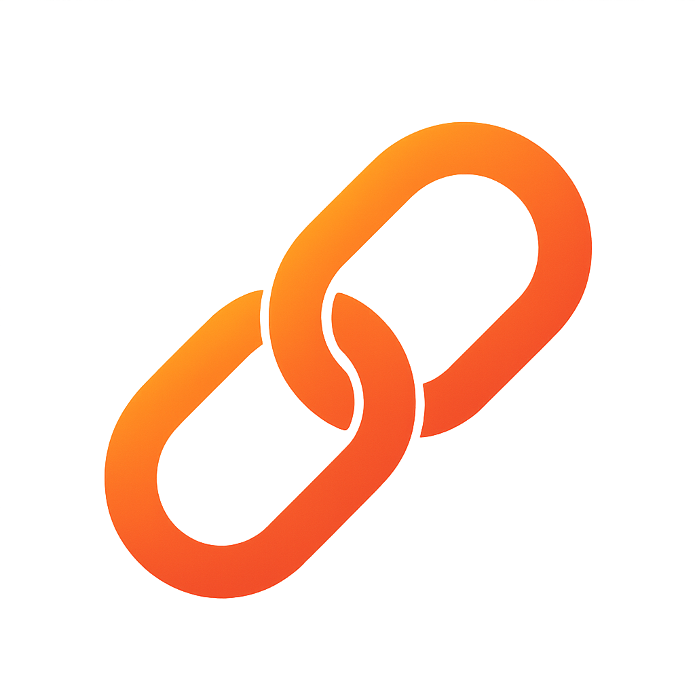

<p align="center">
  
  <h1 align="center">BindKit</h1>
  <h3 align="center">Declarative UIKit building — configuration, layout, and hierarchy made effortless.</h3>
</p>

---

BindKit is a lightweight, expressive utility library that brings **declarative view creation** and **chainable Auto Layout** to UIKit.  
It lets you build and configure UI elements in a single fluent flow — no boilerplate, no layout headaches.

---

## 🚀 What It Does

| Area | Description |
|------|--------------|
| 🧱 **Declarative View Creation** | Build `UILabel()`, `UIButton()`, `UIImageView()`, etc. inline and configure them with `.bk { ... }` |
| 🧩 **Chainable Configuration** | Use `.set(\.property, value)` for inline property setup |
| 📐 **Auto Layout DSL** | Pin, center, and size views with human-readable chain syntax |
| 🧭 **Safe Defaults** | Automatically disables `translatesAutoresizingMaskIntoConstraints` |
| 🔀 **Constraint Groups** | Manage and toggle between sets of constraints dynamically |

---

## 📦 Installation

Use Swift Package Manager:

```swift
.package(url: "https://github.com/yusasarisoy/BindKit.git", from: "1.0.0")
```

Then import what you need:

```swift
import BindKitDeclarative
```
and/or

```swift
import BindKitLayout
```

- **BindKitDeclarative** → for view creation & configuration helpers
- **BindKitLayout** → for the layout DSL (add, pin, center, size)
- Import both for the full experience.

---

## 🧱 Declarative View Creation

BindKit makes creating and configuring UIKit elements declarative and concise.

### `.bk { ... }` — Inline initialization & configuration

```swift
let titleLabel = UILabel().bk {
    $0.font = .preferredFont(forTextStyle: .headline)
    $0.textColor = .label
    $0.numberOfLines = 2
}
```

For reference types (UIView subclasses), this mutates the same instance;  
for value types, it returns a modified copy.

### `.set(\.keyPath, value)` — Chainable property assignment

```swift
let button = UIButton(type: .system)
    .bk
    .set(\.titleLabel?.font, .boldSystemFont(ofSize: 16))
    .set(\.tintColor, .systemBlue)
```

You can freely mix configuration and layout chaining:

```swift
button.bk
    .set(\.contentEdgeInsets, .init(top: 8, left: 16, bottom: 8, right: 16))
    .added(to: view)
    .centered(in: view)
```

---

## 📐 Declarative Auto Layout

Forget anchor boilerplate — layout becomes readable and composable:

```swift
titleLabel.bk
    .added(to: contentView)
    .pinned(.horizontally, to: .view(contentView), insets: .all(12))
    .pinned(.custom([.bottom]), to: .view(contentView))
    .pinned(.custom([.top]), to: .view(thumbnailView), insets: .top(6))
```

Reads like:  
> “Add `titleLabel` into `contentView`, pin it horizontally by 12pt, pin bottom to `contentView`, top 6pt below `thumbnailView`.”

### Common patterns

```swift
// Add to hierarchy
view.bk.added(to: superview)

// Pin edges
label.bk.pinned(.all, to: .safeArea(of: view), insets: .all(16))

// Center
icon.bk.centered(in: container)

// Fixed size or aspect ratio
avatar.bk.sized(width: 44, height: 44)
imageView.bk.withAspect(ratio: 16/9)
```

---

## ⚙️ Combining Creation + Layout

BindKit’s power comes when you do both — create, configure, and layout inline:

```swift
UIImageView().bk {
    $0.contentMode = .scaleAspectFill
    $0.clipsToBounds = true
}
.added(to: contentView)
.sized(width: 72, height: 72)
.pinned(.custom([.leading, .top, .bottom]), to: .view(contentView), insets: .all(12))
```

---

## 🔀 Constraint Groups

Switch between alternative layouts:

```swift
let collapsed = BKConstraintGroup {
    detailsView.bk
        .pinned(.custom([.top]), to: .view(titleLabel), insets: .top(4))
    detailsView.bk.sized(height: 0)
}

let expanded = BKConstraintGroup {
    detailsView.bk
        .pinned(.custom([.top, .bottom]), to: .view(container), insets: .vertical(8))
}

collapsed.activate()
expanded.deactivate()
```

---

## 🧩 Real Example — UITableViewCell

```swift
final class ArticleCell: UITableViewCell {

    private let thumbnail = UIImageView().bk {
        $0.contentMode = .scaleAspectFill
        $0.clipsToBounds = true
    }

    private let titleLabel = UILabel().bk {
        $0.font = .preferredFont(forTextStyle: .headline)
        $0.numberOfLines = 2
    }

    private let subtitleLabel = UILabel().bk {
        $0.font = .preferredFont(forTextStyle: .subheadline)
        $0.textColor = .secondaryLabel
    }

    override init(style: UITableViewCell.CellStyle, reuseIdentifier: String?) {
        super.init(style: style, reuseIdentifier: reuseIdentifier)

        thumbnail
            .added(to: contentView)
            .pinned(.custom([.leading, .top, .bottom]), to: .view(contentView), insets: .all(12))
            .sized(width: 72, height: 72)

        titleLabel
            .added(to: contentView)
            .pinned(.horizontally, to: .view(contentView), insets: .right(12))
            .pinned(.custom([.top]), to: .view(contentView), insets: .top(12))
            .pinned(.custom([.leading]), to: .view(thumbnail), insets: .left(12))

        subtitleLabel
            .added(to: contentView)
            .pinned(.horizontally, to: .view(titleLabel))
            .pinned(.custom([.top]), to: .view(titleLabel), insets: .top(6))
            .pinned(.custom([.bottom]), to: .view(contentView), insets: .bottom(12))
    }

    required init?(coder: NSCoder) {
        fatalError("init(coder:) has not been implemented")
    }
}
```

> One fluent chain: create → configure → add → layout.

---

## 💡 Why BindKit?

- **Declarative UI construction** — create and configure views inline, no `setupViews()` boilerplate  
- **Readable layout syntax** — chain layout like natural language  
- **Safe defaults** — `translatesAutoresizingMaskIntoConstraints` handled for you  
- **Dynamic layouts** — switch constraint groups easily  
- **UIKit-first design** — built purely for UIKit, not another abstraction layer  

---

## 🧭 Best Practices

- Keep configuration (`.bk {}` / `.set()`) and layout (`.added()`, `.pinned()`, etc.) distinct for clarity  
- Use `.safeArea(of:)` and `.view(...)` to make intent clear  
- Don’t overchain trivial cases; the goal is readability, not minimal lines  
- Works perfectly with modular MVVM or router-based architectures  

---

## 🤝 Contributing

PRs and issues are welcome!  
Let’s make UIKit feel modern again.

---

## 🪪 License

MIT
